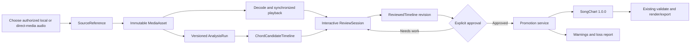

# Audio Transcription Architecture

## Status

This document defines the architecture and interaction contract for the active
Audio-to-Editable-Chart milestone. Stages 1 through 6 now implement authorized
local or direct-HTTPS PCM16 WAV ingestion, playback, versioned reference
inference, a synchronized read-only candidate lane, durable review revisions,
explicit deterministic promotion into SongChart 1.0.0, safe asynchronous
remote acquisition, and private approval-bound practice.

The existing CLI, `SongChart` model, schemas, validation, renderers, and export
formats are Stage 0. They remain the approved publication boundary beneath a
new transcription domain.

## Product Outcome

A musician imports a local recording or explicitly authorizes a supported
direct-media resource, receives a synchronized chord-timeline draft, corrects
it while listening, and explicitly approves a guitar-aware chart.

The detector assists transcription. It does not replace musical judgment.

## Architectural Invariants

1. `SongChart` schema version `1.0.0` remains unchanged during this milestone.
2. Raw detector output never masquerades as an approved chart.
3. Every automatic chord label and segment boundary remains editable.
4. Exact timing, numeric confidence, alternatives, model metadata, and edit
   history remain in a separate transcription contract.
5. Promotion into `SongChart` is explicit, versioned, deterministic, and
   capable of reporting loss or ambiguity.
6. Analysis runs and raw candidates are immutable. Review creates revisions
   rather than overwriting evidence.
7. Local user-authorized media is the first supported source.
8. Private paths and source media are not published by default.
9. URL support does not bypass authentication, access controls, DRM,
   paywalls, regional restrictions, or provider rules.
10. Audio analysis does not authorize lyric, artwork, or recording
    redistribution.

## End-to-End Workflow



The dependency direction is:

```text
source acquisition
  -> media identity and decoding
  -> analysis
  -> candidate timeline
  -> review
  -> promotion
  -> existing chart core
  -> existing render and export
```

The chart core does not depend on decoders, model runtimes, acquisition
adapters, playback, or the UI. The UI composes playback and review services; it
does not own analysis or publication rules.

## Bounded Contexts

### Source Acquisition

Owns the user's request to analyze a source and the authorization basis for
processing it.

Stage 1 supports an explicitly selected local file. Later adapters may resolve
direct media URLs or provider API resources only where access is authorized and
supported.

This context does not infer that a public page is downloadable, does not publish
private locators, and does not own decoded media.

### Media

Owns immutable content identity, technical metadata, decoding, normalized
derivatives, cache lifecycle, and playback access.

Changing the input bytes creates a different `MediaAsset`, even when the
filename is unchanged. Downstream analysis references content identity rather
than a mutable path.

### Analysis

Owns engine execution and immutable outputs. An `AnalysisRun` identifies the
asset, model, model artifact, parameters, and environment needed to explain or
repeat a result.

Rerunning analysis creates a new run. It does not replace the prior timeline or
invalidate a user's completed review.

### Candidate Timeline

Owns precise machine hypotheses:

- beat and downbeat locations;
- tempo and key hypotheses;
- chord segment boundaries;
- primary and alternate chord labels;
- numeric confidence or score;
- no-chord regions;
- raw-to-canonical label normalization.

The candidate timeline has its own future schema version. It is not stored
inside `SongChart.analysis`.

### Review

Owns non-destructive human correction. A review session references one candidate
timeline and produces immutable revisions through replayable edit operations.

The materialized reviewed timeline can be cached, but its authoritative history
identifies one immutable base candidate timeline and a one-edit-per-revision
parent chain. Stage 3 uses strong head preconditions, durable idempotency, and a
monotonic generation so concurrent tabs cannot silently overwrite work.

### Promotion

Owns the only path from reviewed transcription state into `SongChart`.

Promotion maps precise time segments into musical measures and sections,
selects approved chord labels, attaches appropriate provenance, and emits
warnings when the mapping is ambiguous or lossy.

### Publication

The existing Stage 0 chart core owns approved chart validation, serialization,
chord references, rendering, and export. It remains independent of how the
chart was produced.

## Proposed Transcription Models

These sketches establish ownership and required information. They are not yet
stable serialized contracts.

### SourceReference

```text
SourceReference
  id: stable identifier
  kind: local_file | future direct_url | future provider_asset
  display_name: safe user-facing label
  private_locator: local or provider locator, excluded from publication
  authorization_basis: explicit user assertion or provider grant
  captured_at: timestamp
  upstream_metadata: optional safe metadata
  retention_policy: optional future source constraint
```

Rules:

- Selecting a local file is an explicit user action.
- `authorization_basis` records the workflow assertion; it is not a legal
  determination.
- A URL is a locator, not proof of permission.
- Private paths never become `RecordingSource.source_url` automatically.

### MediaAsset

```text
MediaAsset
  id: stable identifier
  source_reference_id
  content_sha256
  original:
    container
    codec
    byte_length
    duration
    sample_rate
    channels
  normalized_artifact:
    content identity
    sample_rate
    channels
    duration_frames
  imported_at
```

Rules:

- Content identity is immutable.
- Original bytes and normalized cache have explicit, separate lifecycles.
- Decode errors retain diagnostics but do not produce a valid normalized asset.
- Published charts do not embed media or private cache references.

### AnalysisRun

```text
AnalysisRun
  id
  media_asset_id
  status: queued | running | succeeded | failed | cancelled
  requested_range: optional [start_frame, end_frame)
  created_at
  started_at
  completed_at
  engine_name
  engine_version
  model_name
  model_version
  model_artifact_digest
  parameters
  random_seed: when relevant
  environment_summary
  output_artifact_ids
  failure_code
  failure_diagnostic
```

Rules:

- Successful results identify the code, model, and parameters that produced
  them.
- Failed and cancelled runs are distinguishable from successful empty output.
- A new model or parameter set creates a new run.
- User-facing diagnostics do not leak credentials or private paths.

### ChordCandidateTimeline

```text
ChordCandidateTimeline
  schema_version
  id
  analysis_run_id
  timebase:
    unit: sample_frame
    sample_rate
  analyzed_range: [start_frame, end_frame)
  beat_grid_hypotheses
  key_hypotheses
  ordered_segments:
    - id
      range: [start_frame, end_frame)
      primary_candidate
      alternate_candidates
      no_chord_probability
```

Each candidate contains:

```text
ChordCandidate
  canonical_symbol
  raw_label
  rank
  confidence
  normalization_notes
```

Rules:

- Segment ranges are half-open, ordered, and non-overlapping.
- Integer sample frames avoid floating-point drift.
- Display timestamps are derived and never used as the authoritative timebase.
- Raw labels are retained when normalization cannot be lossless.
- Unknown or extended chord symbols remain editable even if no built-in guitar
  shape exists.
- Numeric confidence is not flattened prematurely into the chart's
  `low`/`medium`/`high` enum.

### ReviewSession and ReviewEdit

```text
ReviewSession
  id
  candidate_timeline_id
  base_review_revision_id: optional
  current_revision_id
  status: unreviewed | in_review | ready_for_approval | approved
  created_at
  updated_at

ReviewRevision
  id
  review_session_id
  parent_revision_id
  ordered_edit_ids
  materialized_timeline_digest
  created_at

ReviewEdit
  id
  operation
  target_ids
  before
  after
  actor
  created_at
  reason: optional
```

Required operations:

- choose an alternate candidate;
- set a chord label;
- mark or insert `N.C.`;
- split a segment;
- merge adjacent segments;
- move a complete segment while preserving its duration;
- move a boundary;
- add, rename, or move a section marker;
- undo and redo through revision movement.

Movement and boundary behavior must be deterministic. Moving a complete segment
preserves its duration. Moving one boundary defines how adjacent segments
resize. In both cases, collisions and gaps require an explicit preview and user
resolution; they are never overwritten or filled silently.

### ReviewedTimeline

```text
ReviewedTimeline
  review_revision_id
  timebase
  segments
  section_markers
  unresolved_items
  review_summary
```

This is a materialized view of a review revision, not a replacement for the raw
candidate timeline or edit history.

### PromotionResult

```text
PromotionRequest
  review_revision_id
  mapping_version
  musical_grid_choice
  chart_metadata
  approval_actor
  approved_at

PromotionResult
  request_digest
  source_review_revision_id
  song_chart
  warnings
  loss_report
  created_at
```

Rules:

- Approval is explicit and tied to one immutable review revision.
- The same reviewed revision and mapping inputs produce the same chart.
- Exact candidate data remains linked in the transcription artifact.
- Only reviewed chord selections and section/measure mapping cross into
  `SongChart`.
- Appropriate chart provenance uses existing `computed`, `inferred`, and
  user-entered semantics without claiming that the machine result was verified.
- Promotion can fail or require resolution when a deterministic measure mapping
  is not possible.

## Why `SongChart` Remains Separate

The existing `SongChart` is measure- and section-oriented. A `ChartMeasure`
contains chord strings, one optional display timestamp, and provenance. It does
not own:

- exact start and end frames;
- ranked chord candidates;
- numeric confidence calibration;
- model artifacts and parameters;
- raw labels;
- review state;
- replayable edits.

The JSON contract is strict and versioned. Placing ephemeral detector data
under the free-form `analysis` field would technically serialize it but would
collapse the architectural boundary, bind preservation snapshots to model
internals, and make future migration ambiguous.

Any future addition to the `SongChart` contract requires a separate
compatibility decision and schema migration. It is not part of the active
milestone.

## MVP Interaction Specification

### First-run journey

1. The user chooses a local audio file.
2. ChordAtlas asks the user to confirm that they are authorized to process it.
3. The application validates support, fingerprints the bytes, and decodes a
   project-scoped media asset.
4. A player shows a waveform, duration, play/pause, seek, current time, and a
   selected-range loop.
5. The user analyzes the complete file or a selected range.
6. The timeline displays proposed chord blocks with confidence and alternatives.
7. Playback highlights the active chord and keeps the cursor synchronized.
8. The user reviews labels and boundaries using direct manipulation and
   keyboard-accessible commands.
9. Unresolved or low-confidence ranges remain visible.
10. The user marks the review ready and explicitly approves one revision.
11. Promotion maps the review into measures and sections, presenting any
    ambiguity for resolution.
12. Existing validation and render/export produce the approved chart.

### Required timeline actions

- Play or pause without losing selection.
- Seek by clicking or using keyboard controls.
- Loop a segment or selected range.
- Select the active or adjacent chord.
- Rename a chord using text entry.
- Choose a ranked alternate.
- Insert or remove a chord segment.
- Mark a region `N.C.`.
- Split at the playhead.
- Merge compatible adjacent segments.
- Move a complete segment without changing its duration.
- Drag a boundary with a visible precise time.
- Add and move section markers.
- Undo and redo every edit.
- Compare reviewed state with the raw candidate.

### Required states

The interface must visibly distinguish:

- not analyzed;
- analysis queued or running;
- analysis failed;
- proposed and unreviewed;
- reviewed;
- unresolved;
- ready for approval;
- approved;
- promotion failed or completed with warnings.

The first release includes a functional waveform aligned to the same timebase as
playback and chord blocks. Visual ornament is secondary to reliable seeking,
looping, chord highlighting, and boundary manipulation.

### Accessibility and operator safety

- Every pointer action has a keyboard-accessible equivalent.
- Focus, selection, playback, and review state are not communicated by color
  alone.
- Destructive-looking operations are undoable.
- Analysis failure never deletes the media asset or prior review.
- Closing and reopening preserves review work.
- Approval identifies unresolved items and requires an intentional action.

The delivery surface - web, desktop, or another local application model -
remains an implementation decision. This contract specifies product behavior
without choosing a framework prematurely.

## Traced Local-File Scenario

```text
1. User selects authorized file "demo.wav".
2. Source acquisition records a local-file reference and authorization
   assertion without publishing the filesystem path.
3. Media computes content identity A, decodes normalized artifact N, and
   exposes synchronized playback.
4. Analysis run R1 identifies model M1, parameters P1, and the requested range.
5. R1 produces candidate timeline T1 with exact frames, primary chords,
   alternatives, and confidence.
6. Review session S1 starts from T1.
7. User selects an alternate Cadd9, moves a boundary, splits one segment,
   translates another segment without changing its duration, inserts N.C., and
   adds Verse and Chorus markers.
8. Review revision V5 materializes those edits. T1 remains unchanged.
9. User explicitly approves V5.
10. Promotion mapping version P maps V5 to measures and sections and reports
    one timing-rounding warning.
11. The resulting SongChart remains schema version 1.0.0.
12. Existing validation succeeds and existing renderers produce Markdown,
    text, and normalized JSON.
13. R1, T1, S1, V5, and the warning report remain linked for later audit or
    rerun, but are not embedded as raw model data in SongChart.
```

## Milestone Acceptance Criteria

### Complete vertical slice

- One declared local audio format completes import through approved export.
- No YAML editing is required for the scenario.
- The authorized fixture, model, parameters, and mapping version are recorded.
- The exported chart validates against `SongChart` schema `1.0.0`.

### Playback and time

- Waveform, play, pause, seek, and range loop operate on the same authoritative
  timebase as candidate segments.
- The audible position, cursor, and active chord remain synchronized after seek.
- Segment boundaries do not drift after repeated edits or reopen.

### Inference

- A successful run produces ordered timed hypotheses.
- Primary, alternative, confidence, and no-chord state are representable.
- Model and parameter changes produce a distinct immutable run.
- Empty success, failure, and cancellation are distinguishable.

### Review

- Every automatic label and boundary is editable.
- Accept current, rename, alternate selection, duration-preserving interior
  segment move with explicit adjacent adjustment, split, compatible merge,
  boundary move, atomic `N.C.` range replacement, Unknown, section marker,
  reset, undo, and redo are covered by interaction tests.
- Raw candidates remain recoverable.
- Review work survives restart and analysis reruns.
- Unreviewed and unresolved states are visible before finishing.
- Finishing requires explicit review of every proposal and produces
  `ready_for_approval`, not approval.

### Promotion

- Approval references one immutable ready review revision, reviewed-timeline
  digest, mapping spec, issue digest, deterministic result, and material-issue
  acknowledgements.
- An explicit full-coverage integer-frame measure boundary list is authoritative.
  Beat hypotheses are comparison evidence; they never silently establish bars.
- The first mapping version is intentionally constant 4/4, Standard tuning,
  sounding chord notation, and compatible built-in diagram references.
- Ambiguous or lossy mapping is reported with stable material or information
  issues. Material issues require exact-preview acknowledgement.
- No raw detector payload or private media path enters chart output.
- Existing render/export snapshots remain unchanged.
- Revocation is append-only, blocks future exports, and does not mutate prior
  results or claim to retract already written files.

### Failure and recovery

- Unsupported media produces an actionable diagnostic.
- Analysis failure preserves the asset and existing reviews.
- Interrupted processing can retry without corrupting prior runs.
- A failed promotion leaves the musical review approval intact, does not mark
  promotion or publication complete, and does not overwrite a chart.

## Evaluation Strategy

### Corpus

Use an authorized, versioned fixture corpus with human-reviewed chord intervals.
Document:

- rights or authorization basis;
- audio identity;
- annotation author and review;
- chord vocabulary and equivalence rules;
- known ambiguous passages;
- guitar prominence, mix density, and difficulty.

Keep evaluation sources separate from publishable media. Do not check
copyrighted recordings into a public repository without the required rights.

### Inference measures

- Duration-weighted chord-symbol accuracy.
- Root-only accuracy.
- Major/minor accuracy.
- Full-symbol accuracy.
- Top-k candidate recall.
- `N.C.` precision and recall.
- Median boundary error.
- Boundary percentages within 100, 250, and 500 milliseconds.
- Over-segmentation and under-segmentation.
- Beat/downbeat and tempo error.
- Key accuracy with documented relative-major/minor handling.
- Confidence calibration.

Metrics must identify the evaluated label vocabulary and equivalence policy.
Report results by difficulty and source characteristics rather than only one
aggregate score.

### Operator measures

- Time to first playable draft.
- Time to reviewed export.
- Time relative to manual transcription from scratch.
- Accepted-primary percentage.
- Alternate-selection rate.
- Label edits per minute of audio.
- Boundary operations per minute.
- Split, merge, insertion, and deletion counts.
- Undo rate.
- Unresolved low-confidence duration at approval.
- Task completion and abandonment.

Correction effort is the product metric. Numeric release thresholds will be set
after a baseline study instead of being invented in advance.

### Reproducibility

- Fix media identity, annotations, model artifact, parameters, and mapping
  version for a benchmark.
- Preserve prior results when any component changes.
- Report deterministic versus stochastic execution.
- Separate detector quality from promotion quality and operator correction.
- Treat comparison with another product as descriptive unless the same
  authorized corpus and review policy are used.

## Stage 6 Approved-Chart Practice Boundary

Practice begins only after one exact review revision and its private frame grid
have an active approval. It reads the private `PromotionResult.timing_map`,
validates the approval-to-review-to-media chain, and creates separate immutable
`PracticeSession` and `PracticeAttempt` records.

```text
ApprovedSongChart + private exact measure projection
  -> full / section occurrence / measure / custom frame target
  -> bounded playback rate + optional approved-bar count-in
  -> explicit local save
  -> paused restore with a fresh playback capability
```

Practice never writes back into the reviewed timeline, approval, SongChart, or
export. Section names do not determine timing by themselves; each target pins
the ordinal, measure span, and half-open integer frame range. Repeated section
names remain separate occurrences.

The count-in uses the confirmed Stage 4 meter and measure duration, not raw
detector beats or an inferred downbeat. Playback speed is an integer adapter
ratio and never changes the source-frame timebase. Browser playback can
overshoot a loop boundary and may change pitch; ChordAtlas makes neither a
sample-accuracy nor pitch-preservation claim.

See [stage6-implementation.md](stage6-implementation.md) for persistence,
recovery, privacy, UI behavior, and the authorized real-TLS interoperability
protocol, and [stage6-evaluation.md](stage6-evaluation.md) for the engineering
and musician-study boundaries.

## Logic Pro as a Behavioral Reference

Apple documents a workflow in which Logic Pro analyzes audio or MIDI regions
into its Chord track, keeps the result aligned to the timeline, and allows
chords and chord groups to be manipulated:

- [Analyze chords in audio or MIDI regions](https://support.apple.com/guide/logicpro/analyze-chords-audio-midi-regions-logic-pro-lgcp4993e80c/mac)
- [Move and resize chords](https://support.apple.com/guide/logicpro/move-and-resize-chords-lgcp6738dbfa/mac)
- [Work with chord groups](https://support.apple.com/guide/logicpro/work-with-chord-groups-lgcp895d79af/mac)
- [Edit chords](https://support.apple.com/guide/logicpro/edit-chords-lgcp5bdc8ead/mac)
- [Analyze a key signature](https://support.apple.com/en-lamr/guide/logicpro/lgcp48aad421/mac)

ChordAtlas adopts the product lesson "analysis into an editable musical
timeline." It does not use Logic Pro as:

- an implementation dependency;
- a public detector API;
- an accuracy guarantee;
- evidence for confidence scores or alternate candidates;
- evidence for guitar voicing, capo, tuning, or section inference;
- evidence for URL ingestion.

ChordAtlas is independently implemented and is not affiliated with Apple.

## Source Authorization and Privacy

This policy establishes product boundaries, not legal advice.

### Local files

- Import requires explicit user selection.
- The user confirms they own the recording or have permission or another right
  to process it.
- Analysis defaults to local and project-scoped processing.
- Upload or remote retention requires a later explicit feature and disclosure.
- Source identity and analysis date are retained without publishing private
  paths.
- Derived chord facts remain separate from lyrics, artwork, and source media.

### Stage 5 direct-media URL adapter

- The implemented baseline begins only after the local workflow passes.
- Separate page metadata discovery from media retrieval.
- Support direct media or provider APIs only where access is authorized and
  provider rules permit it.
- Require explicit user initiation; do not crawl ambiently.
- Do not bypass authentication, DRM, paywalls, geographic restrictions,
  signed-URL controls, or download restrictions.
- Do not treat public reachability as permission to download or retain media.
- Record adapter identity, a private locator digest, retrieval time,
  authorization assertion, and retention constraint. The exact locator stays
  private.
- Bound, disclose, and make remote caches removable.
- Fail closed when authorization or supported retrieval is unclear.

## Capability Disposition

| Capability | Decision | Reason |
| --- | --- | --- |
| Existing chart core and JSON `1.0.0` | Retain | Approved publication boundary |
| CLI validation and render/export | Retain | Completes the vertical slice |
| Chord shapes and guitar references | Retain | Guitar-aware approved output |
| Provenance primitives | Retain | Trace approved claims |
| Snapshot and release tooling | Retain | Protect stable behavior |
| Recording comparison | Freeze | Useful, but not central to transcription |
| Research provenance expansion | Freeze | Avoid peripheral contract growth |
| Publication polish | Freeze | Resume when it blocks the active workflow |
| Local import and playback | Retain | Implemented first user-facing input path |
| Candidate inference | Retain | Implemented reference draft |
| Review | Retain | Implemented durable local correction foundation |
| Approval and promotion | Retain | Stage 4 implemented trusted-chart boundary |
| Direct authorized URL support | Retain | Stage 5 direct HTTPS WAV baseline |
| Hosted-platform adapters | Defer | Provider and rights design required |
| Stem and multi-guitar analysis | Defer | Too much inference for the first slice |
| Local approved-chart practice | Retain | Stage 6 private foundation implemented |
| Practice scheduling and scoring | Defer | Require musician evidence and explicit metric semantics |
| Community and knowledge graph | Defer | Does not unblock the first outcome |
| Existing shipped features | Remove none | Foundation remains useful |

## Explicit Non-Goals for the First Release

- Perfect or unattended full-song transcription.
- Hosted-platform downloading.
- Authentication, accounts, or collaboration.
- Stem separation or multi-guitar attribution.
- Automatic final capo, tuning, or voicing decisions.
- A model marketplace.
- A knowledge graph.
- Broad export expansion.
- Replacing human review with a confidence threshold.

## Next Implementation Decisions

- Evidence needed before authenticated, cross-origin, or provider-specific URL
  adapters.
- Evidence needed before a shared asynchronous acquisition and analysis queue.
- Credential storage and redaction rules for future authenticated adapters.
- Exact provider-specific distinction between a downloadable authorized media
  resource and a hosted-platform page.
- First musician-study corpus, baseline results, and evidence-based thresholds.
- A future compatible-tuning diagram policy and linked per-chord arrangement
  contract; these must not be smuggled into SongChart 1.0.0.
- Authorized musician evidence for practice setup time, wrong-range selection,
  browser loop overshoot, delayed playback after count-in, and pitch
  acceptability at bounded rates.

See [Stage 4: Guitar-Aware Chart Generation](stage4-implementation.md) for the
implemented mapping and approval contracts and
[Stage 4 musician-study protocol](stage4-evaluation.md) for evaluation controls.
